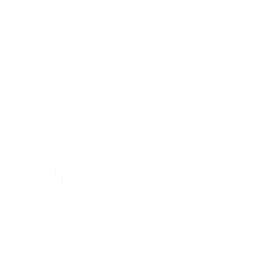
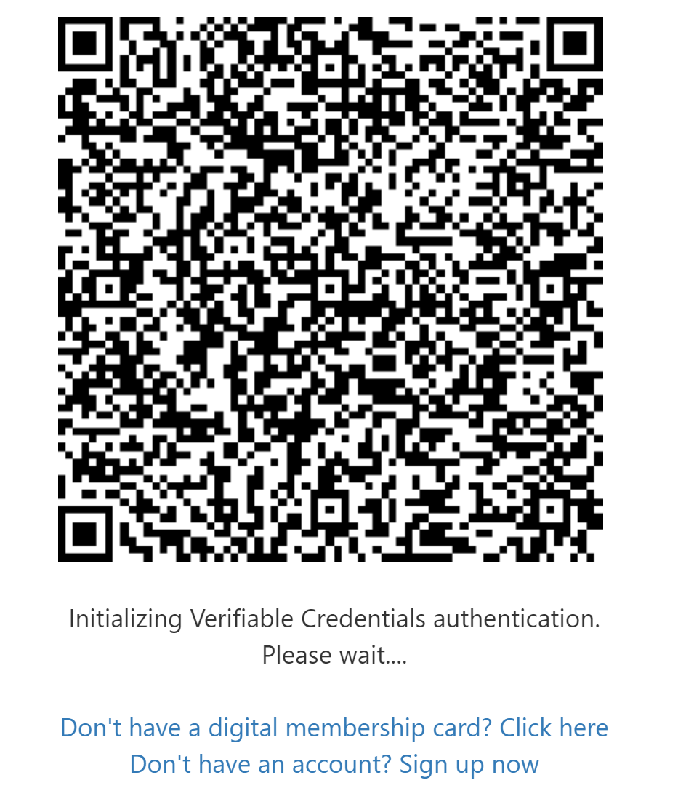

<div id="top"></div>
<!--
*** Thanks for checking out the Best-README-Template. If you have a suggestion
*** that would make this better, please fork the repo and create a pull request
*** or simply open an issue with the tag "enhancement".
*** Don't forget to give the project a star!
*** Thanks again! Now go create something AMAZING! :D
-->

<!-- PROJECT SHIELDS -->
<!--
*** I'm using markdown "reference style" links for readability.
*** Reference links are enclosed in brackets [ ] instead of parentheses ( ).
*** See the bottom of this document for the declaration of the reference variables
*** for contributors-url, forks-url, etc. This is an optional, concise syntax you may use.
*** https://www.markdownguide.org/basic-syntax/#reference-style-links
-->
<div align="center" markdown="1">
  
[![Contributors][contributors-shield]][contributors-url]
[![Issues][issues-shield]][issues-url] 
[![Stars][stars-shield]][stars-url]
[![MIT License][license-shield]][license-url]
[![LinkedIn][linkedin-shield]][linkedin-url]


</div>

<!-- PROJECT LOGO -->
<br />
<div align="center">
  <a href="#">
    
  </a>

  <h3 align="center">Real Estate Consortium</h3>

  <p align="center">
    Consortium documentation & Home page
    <br />
    <a href="#getting-started"
      ><strong>Explore the docs »</strong></a
    >
    <br />
    <br />
    <a href="#">View Demo</a>
    ·
    <a href="https://github.com/mortgageconsortium/mortgageconsortium.github.io/issues"
      >Report Bug</a
    >
    ·
    <a href="https://github.com/mortgageconsortium/mortgageconsortium.github.io/issues"
      >Request Feature</a
    >
  </p>
</div>

<!-- TABLE OF CONTENTS -->
<details>
  <summary>Table of Contents</summary>
  <ol>
    <li>
      <a href="#about-the-project">About The Project</a>
      <ul>
        <li><a href="#built-with">Built With</a></li>
      </ul>
    </li>
    <li>
      <a href="#getting-started">Getting Started</a>
      <ul>
        <li><a href="#prerequisites">Prerequisites</a></li>
        <li><a href="#features">Features</a></li>
        <li><a href="#limitations">Limitations</a></li>
      </ul>
    </li>
    <li><a href="#usage">Usage</a></li>
    <li><a href="#roadmap">Roadmap</a></li>
    <li><a href="#contributing">Contributing</a></li>
    <li><a href="#license">License</a></li>
    <li><a href="#contact">Contact</a></li>
  </ol>
</details>

<!-- ABOUT THE PROJECT -->
## Project page
[![Illustration demo page][product-screenshot]](../../assets/img/mcons-demo.png) 


<p align="right">(<a href="#top">back to top</a>)</p>

### Built With 

This section should list any major providers/frameworks/libraries used to
bootstrap our project. Whole project is built on Azure & GitHub resources and leverage all benefits.

* [Azure](https://azure.microsoft.com) 
* [GitHub](https://github.com) 
* [Nestjs](https://nestjs.com/) 
* [Angular](https://angular.io/)

<p align="right">(<a href="#top">back to top</a>)</p>


<!-- GETTING STARTED -->
## Getting Started 
  
In this section we give you instructions on
setting up prerequisites and being aware of features that are currently available.

### Prerequisites 
This is an example of how to list things you need to use the software and how to install them. 

* Microsoft Authenticator installed on your phone
  - [Get Authenticator App](https://app.adjust.com/e3rxkc_7lfdtm?fallback=https%3A%2F%2Fplay.google.com%2Fstore%2Fapps%2Fdetails%3Fid%3Dcom.azure.authenticator)

### Features


* Simulate how easy can be buy or sell property via crypto. 
* We are using Ethereum. All transactions are done on testnet and you can find any details [here](https://etherscan.io/)
* We are using concept of decentralized identity to verify multiple claims (ie. the owner of the property)
* You do not need your own Wallet. It is generated for you. In the future we would like to support your own web wallet [Metamask](https://metamask.io/) or hardware wallet [Trezor](https://trezor.io/)
* All contracts are prepared. Because we are using blockchain, appropriate contracts are created as smart contracts. Therefore, no third party is needed.
* From security and audit reasons, all main steps in workflow and user transactions are persisted in Confidential Ledger.
* Contact between participants using audio/video call. []()
* Contact between participants using chat. []()
* You do not need anything - just play the game with your friend, colleague, wife, husband, neighbor etc.

### Limitations

* This is demo platform. All data can be lost.
* Application is under development, therefore it might happen some outage.

<!-- * npm ```sh npm install
npm@latest -g ``` 

### Installation 
_Below is an example of how you can instruct
your audience on installing and setting up your app. This template doesn't rely
on any external dependencies or services._ 
1. Get a free API Key at
[https://example.com](https://example.com) 
2. Clone the repo ```sh git clone
https://github.com/your_username_/Project-Name.git ``` 
3. Install NPM packages ```sh npm install ``` 
4. Enter your API in `config.js` ```js const API_KEY = 'ENTER YOUR API'; ``` -->

<p align="right">(<a href="#top">back to top</a>)</p>

<!-- USAGE EXAMPLES -->
## Usage 

### Platform Roles
  Roles are important for the work with application. You can be buyer or seller. Currently, we support only one buyer and one seller on one case. Multiple byuers or sellers we have on our roadmap.
  - Buyer
     - This role you will get automaticaly when you create a case.
  - Seller
     - You can get this role after some buyer invite you as a seller. This is for simplicity to go over the demo and try all features.

### Decentralized Identity
  Concept of Decentralized Identity
  - TBD
### How to use Decentralized Identity

  1. [Open application](https://app.consortium.mortgage)
  2. Look at the decision tree and decide what to do.
  ```mermaid
flowchart LR
    A[Identity] --> B{Have you already created identity?}
    B -- Yes --> C{Have you issued a membership card?}
    C -- No --> D[Issue your card]
    C -- Yes --> E[Scan QRCode & Sign in]
    B -- No --> F[SignUp]
click D "https://mconsissuer.azurewebsites.net" "Issue your card here"
click E "https://app.consortium.mortgage" "Sign in"
```

  3. SignUp
      - Currently, for the demo purpose you will use AAD as Identity Provider. In the future this could be changed to any other IDP, for instance BankID.
      - Click `sign up now`
      <p align="left">
        
      </p>

  4. After successful sign-up, please wait approximately 1 hour for verification of your identity
  5. Issue your credentials to your phone - Follow the instructions [Here](https://mconsissuer.azurewebsites.net/)
  6. Open application [here](https://app.consortium.mortgage) and scan the QRCode with Authenticator App
  7. Enjoy the platform :blush:

### Issue credentials from Land Registry Issuer

```
  Land Registry issues claims about the property to your wallet. In our demo, if you are seller you need to prove your ownership. 
  For the simplicity, we generate some ID as the property ID for you. 
  This attribute you can see within your credentials in Authenticator app and then you are easily decide who can read what.
  ```

<!-- <div class="warning" style='background-color:#E9D8FD; color: #69337A; border-left: solid #805AD5 4px; border-radius: 4px; padding:0.7em;'>
<span>
<p style='margin-top:1em; text-align:center'>
<b>On the importance of sentence length</b></p>
<p style='margin-left:1em;'>
This sentence has five words. Here are five more words. Five-word sentences are fine. But several together bocome monotonous. Listen to what is happening. The writing is getting boring. The sound of it drones. It's like a stuck record. The ear demands some variety.<br><br>
    Now listen. I vary the sentence length, and I create music. Music. The writing sings. It has a pleasent rhythm, a lilt, a harmony. I use short sentences. And I use sentences of medium length. And sometimes when I am certain the reader is rested, I will engage him with a sentence of considerable length, a sentence that burns with energy and builds with all the impetus of a crescendo, the roll of the drums, the crash of the cymbals -- sounds that say listen to this, it is important.
</p>
<p style='margin-bottom:1em; margin-right:1em; text-align:right; font-family:Georgia'> <b>- Gary Provost</b> <i>(100 Ways to Improve Your Writing, 1985)</i>
</p></span>
</div> -->

  1. [Open application](https://cadasterverifier.azurewebsites.net/) and follow the instructions.
  2. After successful issuance, you can prove that you are the owner of the property to any Verifier :astonished:

<p align="right">(<a href="#top">back to top</a>)</p>

<!-- ROADMAP -->
## Roadmap 
- [x] Add back to top links 
- [ ] Add public project with roadmap 
- [ ] Add Additional Templates w/ Examples 
- [ ] Add "components" document to easily copy & paste sections of the readme 
- [ ] 
See the [open issues](https://github.com/mortgageconsortium/mortgageconsortium.github.io/issues) for a full
list of proposed features (and known issues).

<p align="right">(<a href="#top">back to top</a>)</p>

<!-- CONTRIBUTING -->
## Contributing 

We are constantly learning, inspiring and creating. Any feedback you make is
**greatly appreciated**. If you have a suggestion that would make this better,
please use our [discussions](https://github.com/orgs/mortgageconsortium/discussions). You can also simply open an
issue with the tag "enhancement". 
Don't forget to give the project a star!
Thanks again!

<p align="right">(<a href="#top">back to top</a>)</p>

<!-- LICENSE -->
## License 
Distributed under the MIT License. See `LICENSE` for more information.

<p align="right">(<a href="#top">back to top</a>)</p>

<!-- CONTACT -->
## Contact 
- [Twitter](https://twitter.com/Tomas97762057) 
- [LinkedIn](https://www.linkedin.com/in/tomas-slavik)
- [GitHub](https://github.com/mortgageconsortium)

<p align="right">(<a href="#top">back to top</a>)</p>

<!-- ACKNOWLEDGMENTS -->
<!-- ## Acknowledgments Use this space to list resources you find helpful and would
like to give credit to. I've included a few of my favorites to kick things off!
* [Choose an Open Source License](https://choosealicense.com) * [GitHub Emoji
Cheat Sheet](https://www.webpagefx.com/tools/emoji-cheat-sheet) * [Malven's
Flexbox Cheatsheet](https://flexbox.malven.co/) * [Malven's Grid
Cheatsheet](https://grid.malven.co/) * [Img Shields](https://shields.io) *
[GitHub Pages](https://pages.github.com) * [Font
Awesome](https://fontawesome.com) * [React
Icons](https://react-icons.github.io/react-icons/search)

<p align="right">(<a href="#top">back to top</a>)</p> -->

<!-- MARKDOWN LINKS & IMAGES -->
<!-- https://www.markdownguide.org/basic-syntax/#reference-style-links -->
[contributors-shield]:
https://img.shields.io/badge/contributors-4-green?style=for-the-badge
[contributors-url]:
https://github.com/mortgageconsortium/mortgageconsortium.github.io/graphs/contributors
[forks-shield]:
https://img.shields.io/github/forks/othneildrew/Best-README-Template.svg?style=for-the-badge
[forks-url]: https://github.com/othneildrew/Best-README-Template/network/members
[stars-shield]:
https://img.shields.io/badge/stars-7-B04300?style=for-the-badge
[stars-url]: https://mortgageconsortium/mortgageconsortium.github.io/stargazers
[issues-shield]:
https://img.shields.io/github/issues/othneildrew/Best-README-Template.svg?style=for-the-badge
[issues-url]: https://github.com/mortgageconsortium/mortgageconsortium.github.io/issues
[license-shield]:
https://img.shields.io/badge/license-MIT-blueviolet?style=for-the-badge
[license-url]:
https://github.com/mortgageconsortium/mortgageconsortium.github.io/blob/master/LICENSE
[linkedin-shield]:
https://img.shields.io/badge/-LinkedIn-black.svg?style=for-the-badge&logo=linkedin&color=blue
[linkedin-url]: 
https://www.linkedin.com/in/tomas-slavik 
[product-screenshot]: 
assets/img/mcons-demo.png
